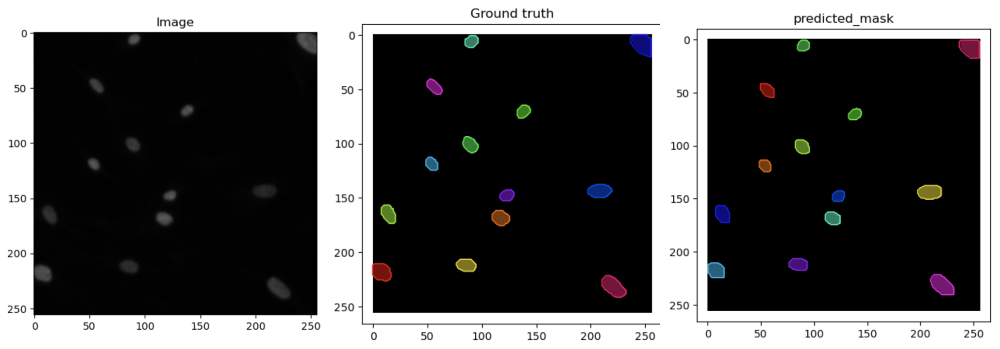
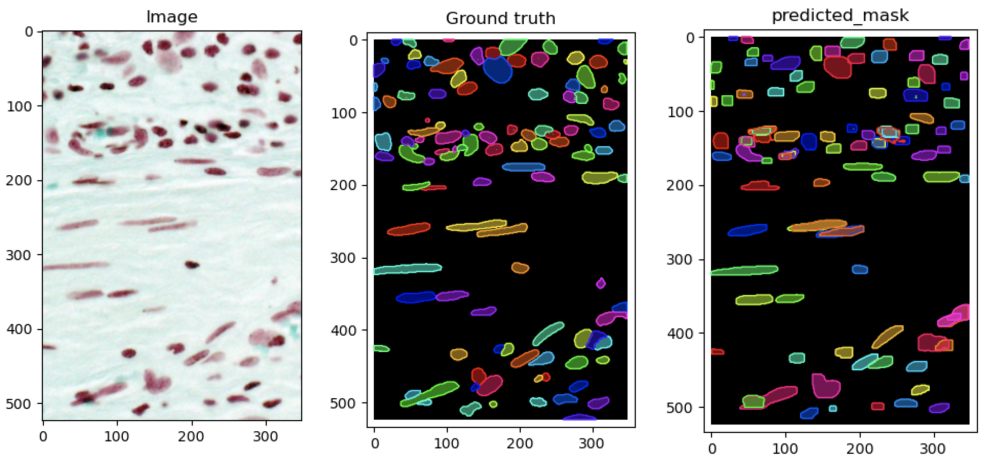

# Instance segmentation of cell nucleus across multiple image modalities using MASK R-CNN
This is a project applying a popular model in Computer Vision, MASK R-CNN, for instance segmentation of cell nuclei across multiple imaging modalities, including fluorescence imaging, wide-field imaging, H&E imaging, etc. As instance segmentation of cell nucleus is usually the first step in the image analysis workflow of multiple research areas, this project can greatly benefit the research in pathology studies, drug discovery and functional genomics.

## Dataset
The data used for this project is from 2018 Data Science Bowl, which is publicly accessible in the Broad Bioimage Benchmark Collection with accession number BBBC038. It includes images used for stage 1 competition sponsored by Booz Allen Hamilton and hosted on the data science website kaggle.com. The data consists of 729 microscopy images and corresponding annotations for each nucleus detected by human experts. It is further split into training (82.9MB) and first testing (9.5MB). Five different imaging modalities, which are small fluorescent, large fluorescent, purple tissue (H&E), pink and purple tissue (H&E) and gray-scale tissue, are included in this dataset ((https://www.kaggle.com/c/data-science-bowl-2018). 

## Codes
nucleus_seg_pytorch.ipynb contains the main codes for data loading, data preprocessing, model construction and model evaluation.

Detection is a file from Pytorch Mask R-CNN tutorial that contains utils functions for model training (https://pytorch.org/vision/main/models/mask_rcnn.html).

## Performance
**Qualitative performance:**   
The MASK R-CNN model showed good performance with mean average precision (mAP) of 39.03%, F1 score at 0.7 IoU of 62.86%, and dice score of 81.43% in limited training epochs. This project demonstrated the great potential of Mask R-CNN in automatic nucleus segmentation. 
**Quantitative performance (demos):**  
Fluorescence image:

H&E image:

